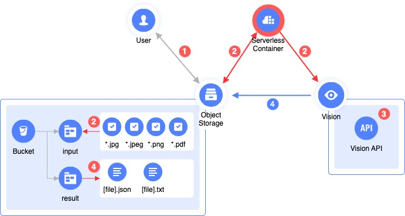

# OCR Recognizer 

This script retrieves images and PDF documents from an [Object Storage](https://yandex.cloud/en-ru/services/storage)) bucket, sends them to [Vision]https://yandex.cloud/en-ru/services/vision) for recognition, and then saves the recognition results back to the Object Storage [bucket](https://yandex.cloud/en-ru/docs/storage/concepts/bucket).

Written in Python, it can be easily analyzed, modified, and optimized for your specific use case.
<br><br>

## Recognition steps


<br><br>

1. The user uploads images or documents in [supported formats](https://yandex.cloud/en/docs/vision/concepts/ocr/#image-requirements) to the `input` directory (prefix) in the Object Storage bucket. 

2. The script retrieves the newly created objects from the `input` directory, and sends them for recognition. 

3. Files are sent for recognition, `operation_id` of the recognition task is saved in `process` directory of the bucket.

4. The script triggered by the timer, checks the `process` directory and the status of operations that are stored there. Results are saved in `result` directory in TXT and JSON formats, operation is deleted from `process` directory.

## Usage

Ready to use [Terraform module](example/) can deployed, and all the required resources will be created:
- Serverless container
- Triggers
- Object storage bucket
- Service accounts

The bucket will have a name like `ocr-recognition-xxx`, `input` directory should be created in it, and PDF-documents and images should be uploaded there.
Results will be saved into `result` directory.

### Locally

Python script can be run locally, like:
```
python src/async_ocr_client.py --api-key xxx --image-path file.png
```

As a result, the `operation_id` will be retrieved, which can be used to get the results:
```
python src/async_ocr_client.py --operation-id xxx --api-key yyy --output file.txt
```

You still need to create a service account and API key:
1) [Create a service account](https://yandex.cloud/en-ru/docs/iam/operations/sa/create)
2) [Assign a role](https://yandex.cloud/en-ru/docs/iam/operations/sa/assign-role-for-sa) `ai.vision.user`
3) [Create API key](https://yandex.cloud/en-ru/docs/iam/operations/authentication/manage-api-keys#create-api-key)
