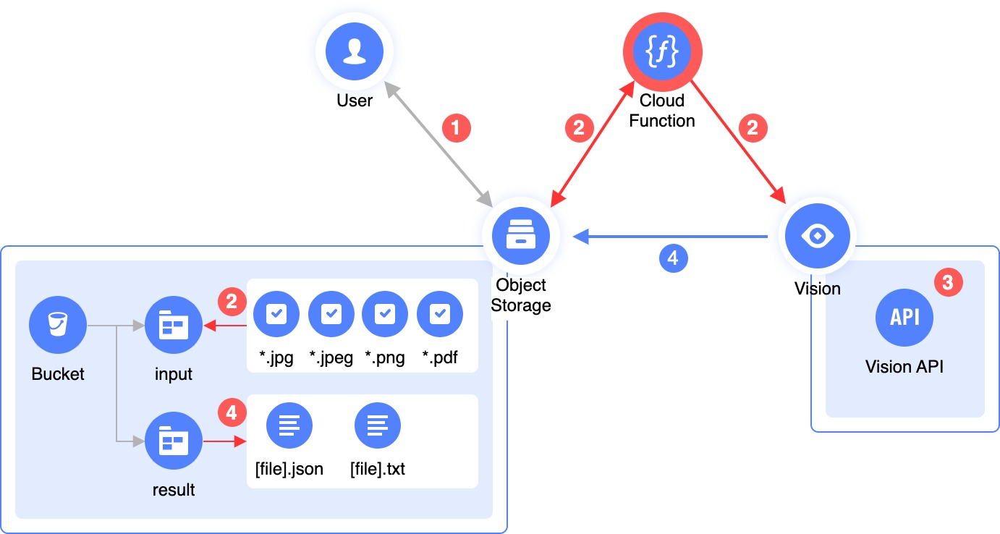

# OCR Recognizer 

This script retrieves images and PDF documents from an [Object Storage](https://[cloud.yandex.ru/services/storage](https://yandex.cloud/en/services/storage)) bucket, sends them to [Vision](https://yandex.cloud/en/services/vision) for recognition, and then saves the recognition results back to the Object Storage [bucket](https://yandex.cloud/en/docs/storage/concepts/bucket).

Written in Python, it can be easily analyzed, modified, and optimized for your specific use case.
  

## Recognition steps

  

1. The user uploads images or documents in [supported formats](https://yandex.cloud/en/docs/vision/concepts/ocr/#image-requirements) to the `input` directory (prefix) in the Object Storage bucket. 

2. The script retrieves the `input` folders from the bucket, generates a list of files for recognition, skipping unsupported formats and files that have already been recognized (by checking the `result` folder for the files in question). 

3. Then, it downloads files from the list one by one via [direct links](https://yandex.cloud/en/docs/storage/concepts/pre-signed-urls) and sends them to Vision for recognition.

4. Vision receives the file, processes it, and returns the recognition result, which is saved to the `result` folder in both JSON and TXT formats.

## Usage

You can run the script locally. To do this, specify the following environment variables:

| Variable        | Description 
| -------------     | ------------- 
| S3_BUCKET         | [Bucket](https://yandex.cloud/en/docs/storage/concepts/bucket) name in Object Storage
| S3_PREFIX         | Prefix (or directory) for incoming files, e.g., `input`
| S3_PREFIX_OUT     | Prefix (or directory) for processing results, e.g., `result`
| S3_KEY            | [Static access key](https://yandex.cloud/en/docs/iam/operations/sa/create-access-key) ID
| S3_SECRET         | [Static access key](https://yandex.cloud/en/docs/iam/operations/sa/create-access-key) secret
| API_SECRET        | [API key](https://yandex.cloud/en/docs/iam/operations/api-key/create) secret
| FOLDER_ID         | [Folder ID](https://cloud.yandex.ru/docs/resource-manager/operations/folder/get-id)

You may want to separate files for processing and the processing results by using different prefixes (subfolders). Failing to do so may lead to unpredictable behavior.

To generate both an S3 key and an API key, [create a service account](https://cloud.yandex.ru/docs/iam/operations/sa/create) and [assign](https://cloud.yandex.ru/docs/iam/operations/sa/assign-role-for-sa) the `storage.editor` and `ai.vision.user` roles.
  

## Use cases

You can leverage a ready-to-use [Terraform module](examples/ocr-function) that creates all required resources to start processing images and documents.
